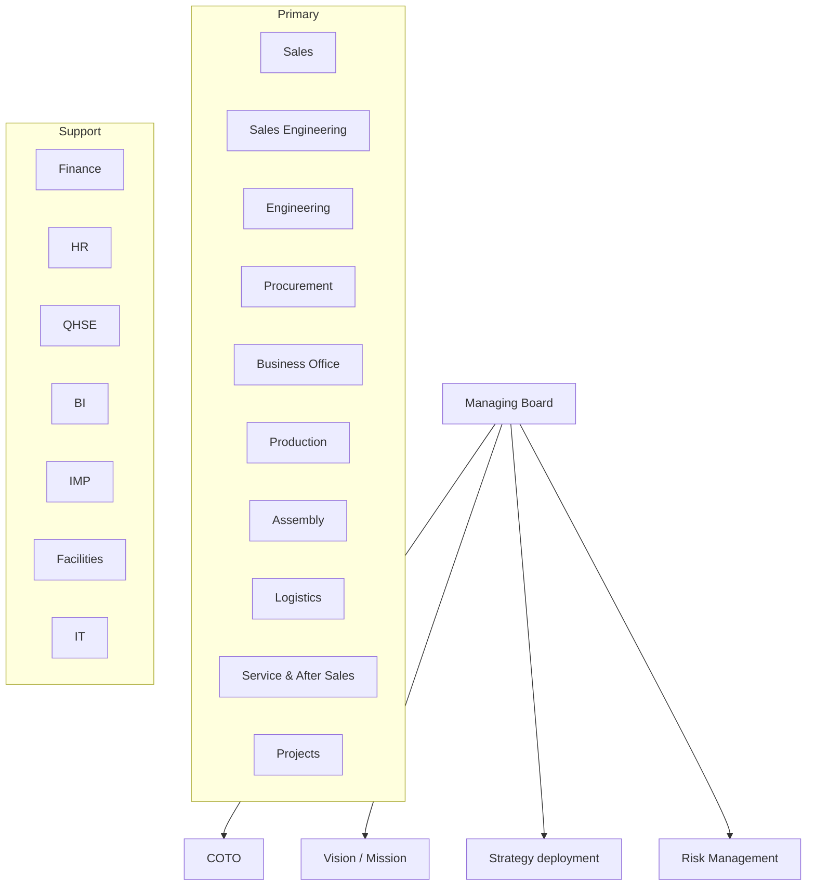

---
{"dg-publish":true,"permalink":"/bms/","tags":["gardenEntry"],"noteIcon":"lightbulb"}
---

# Bollegraaf Management System Dashboard

> [!tip] Quick Navigation
> 
> - [[Weekly Meeting Notes\|Weekly Meeting Notes]]
> - [[Current Projects\|Current Projects]]
> - [[Company Calendar\|Company Calendar]]
> - [[Internal Policies\|Internal Policies]]

## Management Structure

## Management Structure

mermaid

### Managing Board

![[Managing Board Dashboard\|Managing Board Dashboard]]

### Strategic Level

 

![[COTO Dashboard\|COTO Dashboard]]

 

![[Vision and Mission Dashboard\|Vision and Mission Dashboard]]

 

![[Strategy Deployment Dashboard\|Strategy Deployment Dashboard]]

 

![[Risk Management Dashboard\|Risk Management Dashboard]]

 

### Primary Departments

 

![[Sales Dashboard\|Sales Dashboard]]

 

![[Sales Engineering Dashboard\|Sales Engineering Dashboard]]

 

![[Engineering Dashboard\|Engineering Dashboard]]

 

![[Procurement Dashboard\|Procurement Dashboard]]

 

![[Business Office Dashboard\|Business Office Dashboard]]

 

![[Production Dashboard\|Production Dashboard]]

 

![[Assembly Dashboard\|Assembly Dashboard]]

 

![[Logistics Dashboard\|Logistics Dashboard]]

 

![[Service and After Sales Dashboard\|Service and After Sales Dashboard]]

 

![[Projects Dashboard\|Projects Dashboard]]

 

### Support Functions

 

![[Finance Dashboard\|Finance Dashboard]]

 

![[HR Dashboard\|HR Dashboard]]

 

![[QHSE Dashboard\|QHSE Dashboard]]

 

![[BI Dashboard\|BI Dashboard]]

 

![[IMP Dashboard\|IMP Dashboard]]

 

![[Facilities Dashboard\|Facilities Dashboard]]

 

<a class="markdown-embed-link" href="/it-dashboard/" aria-label="Open link"><svg xmlns="http://www.w3.org/2000/svg" width="24" height="24" viewBox="0 0 24 24" fill="none" stroke="currentColor" stroke-width="2" stroke-linecap="round" stroke-linejoin="round" class="svg-icon lucide-link"><path d="M10 13a5 5 0 0 0 7.54.54l3-3a5 5 0 0 0-7.07-7.07l-1.72 1.71"></path><path d="M14 11a5 5 0 0 0-7.54-.54l-3 3a5 5 0 0 0 7.07 7.07l1.71-1.71"></path></svg></a>

 
 

## Recent Updates

| File                                                                                                                                                                             | Last Modified             |
| -------------------------------------------------------------------------------------------------------------------------------------------------------------------------------- | ------------------------- |
| [[BMS\|BMS]]                                                                                                                                                                  | 1:17 PM - April 17, 2025  |
| [[IT Dashboard\|IT Dashboard]]                                                                                                                                                | 12:28 PM - April 17, 2025 |
| [[IT/PO (Policies)/ISMS-PO-SEC-001 Information Security Policy\|ISMS-PO-SEC-001 Information Security Policy]]                                                                 | 12:17 PM - April 17, 2025 |
| [[IT/IN (Instructions)/ISMS-IN-SEC-015 Requesting Access For External Parties to Microsoft Teams\|ISMS-IN-SEC-015 Requesting Access For External Parties to Microsoft Teams]] | 11:35 AM - April 17, 2025 |
| [[IT/FM (Forms)/ISMS-FM-SEC-AUP  Acceptable Use Policy Acknowlegement Form\|ISMS-FM-SEC-AUP  Acceptable Use Policy Acknowlegement Form]]                                      | 9:21 AM - April 17, 2025  |

{ .block-language-dataview}

## Most Accessed Notes

Top accessed notes will appear here once you implement access tracking

## Key Resources

> [!note]- Company Policies
> 
> - [[Employee Handbook\|Employee Handbook]]
> - [[Safety Procedures\|Safety Procedures]]
> - [[Quality Standards\|Quality Standards]]
> - [[Company Values\|Company Values]]

> [!note]- Templates
> 
> - [[Meeting Minutes Template\|Meeting Minutes Template]]
> - [[Project Brief Template\|Project Brief Template]]
> - [[Weekly Report Template\|Weekly Report Template]]
> - [[Employee Onboarding Checklist\|Employee Onboarding Checklist]]

> [!note]- Department Quick Links
> 
> - [[Sales Pipeline\|Sales Pipeline]]
> - [[Engineering Projects\|Engineering Projects]]
> - [[Production Schedule\|Production Schedule]]
> - [[Financial Reports\|Financial Reports]]

## Upcoming Events

| File | Date | Event |
| ---- | ---- | ----- |

{ .block-language-dataview}

## Search

> [!tip] Can't find what you're looking for? Use Obsidian's search functionality (Ctrl+P or Cmd+P) or create a new note with the + button.